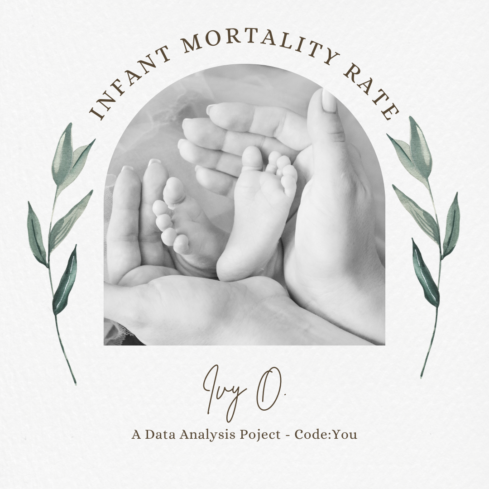

# **Infant Mortality Rate Project Analysis**

This project aims to analyze child mortality rates in the world using data covering the periods 1990, 2000 & 2021. The data used is from UNICEF's State of the World's Children 2023: Statistical tables. The goal of this analysis is to better understand the health of populations, help improve healthcare systems, and support the implementation of effective interventions to reduce infant mortality and improve maternal and child health outcomes.

Python will be used for data preprocessing, analysis, and modeling,
while Tableau, Plotly & Matplotlib for data visualization.

Source of data:

https://data.unicef.org/resources/dataset/the-state-of-the-worlds-children-2023-statistical-tables/

**Resources:**

*   Data sets on child mortality
*   Git
*   Google Colab or Visual Studio Code
*   Tableau software for visualization
*   Data dictionary (included in the readme and project folder)

**Deliverables:**

*   Cleaned and preprocessed child mortality data
*   Python/Pandas scripts for data analysis and modeling
*   Tableau dashboards ([My Public Tableau](https://public.tableau.com/app/profile/ivy.owusu/vizzes)) and visualizations
*   Project report

**Features:**
1. Data collection: Read in two .CSV data files
2. Data processing: Cleaned and processed data; performed a data (pandas) merge with the two .csv files                    
    *   Checked for missing values, duplicates, data types and basic statistics
    *   Replaced NaNs with zeros
    *   Printed out column names
    *   Transformed the data for viewing trends over time
3. Data visualization: presented the data using
                            *  a Tableau dashboard
                            *  3 matplotlib visualizations
                            *  plotly
  
  
4. Best practices
5. Data dictionary
6. Data interpretation

**Best Practices:**

1. Clone the repository
2. Open Git
3. Create a virtual environment using Venv
  a. Install venv to your host Python by running this command in your terminal:
        ~ pip install virtualenv
  b. To use venv in your project, in your terminal, create a new project folder, cd to the project folder in your terminal, and run the following command:
        ~ python<version> -m venv venv
    The second "venv" is the <virtual-environment-name>
  c. Then run:
        ~ pip install -r requirements.txt
4. Clone the repository by typing:
        ~ git clone followed by the link you copied from GitHub
5. Run the project

**How to Deactivate a Virtual Environment:**
To deactivate your virtual environment, simply run the following code in the terminal:

        ~ deactivate

To run this project, Git, Visual Studio Code, or Google Colab will be required.

In order to run the project in Google Colab, upload the data files to your Google drive.

If you do not want to clone it, follow these steps:
1. Go to colab.google
2. Click the button OPEN COLAB
3. Select GitHub
4. Type in "ivyownn" and click on Enter
5. Select the .ipynb under Path and click on it
This should pull up the project

**How to install:**
*  [Git](https://github.com/git-guides/install-git)

*  [VS Code](https://code.visualstudio.com/download)

*  [Google Colab](https://research.google.com/colaboratory/)

**Other resources:**

https://data.unicef.org/resources/dataset/the-state-of-the-worlds-children-2023-statistical-tables/

https://www.freecodecamp.org/news/how-to-setup-virtual-environments-in-python/

**Image Credit:**
J.T. Elliot

**Future plans:**

I hope to compare current data at a latter time to see if the trends are continuing or if outside factors have impacted child mortality in any way.
